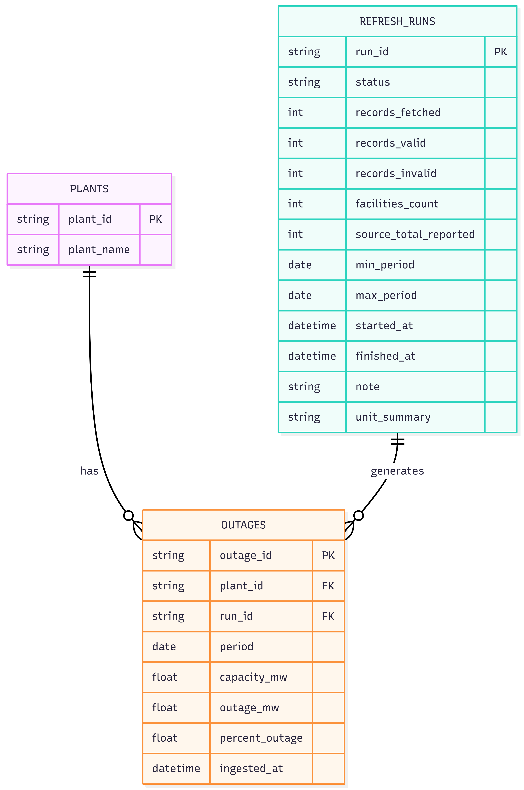
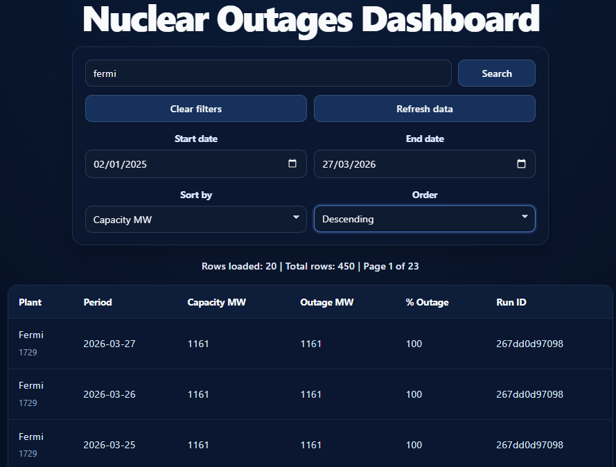
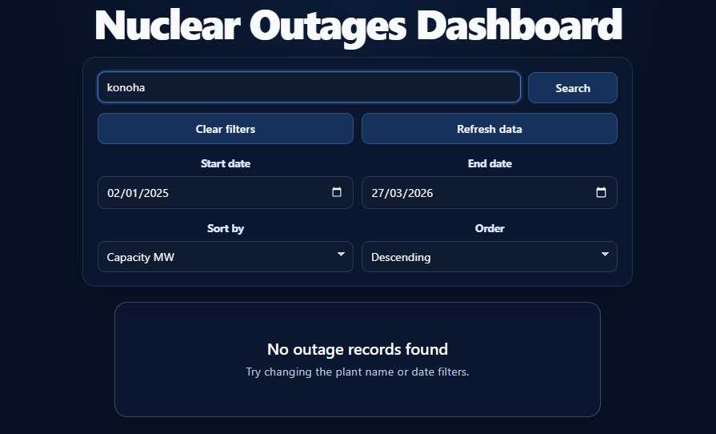
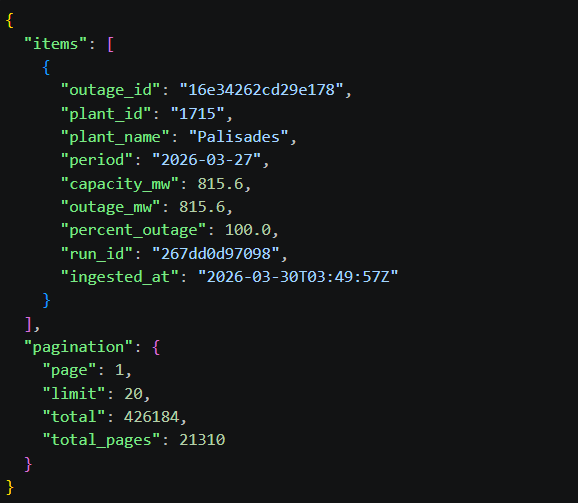

# Arkham Nuclear Outages Challenge

## Overview

This project is a mini data platform that extracts **Nuclear Outages** data from the **EIA Open Data API**, stores it efficiently in **Parquet** format, exposes it through a **FastAPI** service, and presents it via a **React** web interface.

The solution is organized into four core parts:

1.  **Data Connector:** Python script that handles EIA API authentication, pagination, retries, and data validation.
2.  **Data Model:** A relational-style schema (3 tables) optimized for traceability and performance using Parquet.
3.  **Simple API:** A FastAPI backend providing endpoints for data querying (`/data`) and triggering updates (`/refresh`).
4.  **Data Preview Interface:** A React dashboard with server-side filtering, sorting, pagination, and user-friendly status feedback.

---

## Tech Stack

| Layer        | Technologies                                        |
| :----------- | :-------------------------------------------------- |
| **Backend**  | Python, FastAPI, Uvicorn, Pandas, Requests, PyArrow |
| **Frontend** | React (Vite), CSS3, JavaScript (ES6+)               |
| **Storage**  | Parquet Files (Local)                               |

---

## Project Structure

```text
arkham-nuclear-outages/
├── backend/
│   ├── app/
│   │   ├── api/            # API Route handlers
│   │   ├── core/           # Config and Security
│   │   ├── repositories/   # Data access logic (Parquet)
│   │   ├── services/       # Business logic & EIA Connector
│   │   └── utils/          # Helpers & Logging
│   └── scripts/            # Independent maintenance scripts
├── data/
│   └── parquet/            # Storage location for .parquet files
├── frontend/
│   └── src/
│       ├── components/     # Reusable UI components
│       └── services/       # Frontend API calls
├── .env.example            # Template for environment variables
├── .gitignore
└── README.md
```

## Quick Start

### 1. Clone the repository

```bash
git clone <your-repo-url>
cd arkham-nuclear-outages
```

### 2. Configure Environment Variables

Copy the template file to create your local environment configuration:

```bash
cp .env.example .env
```

Open the `.env` file in the project root and replace `your_api_key_here` with your actual **EIA API Key**.

### 3. Setup Backend

```powershell
# Activate the virtual environment (Windows PowerShell only)
.\.venv\Scripts\Activate.ps1
# Install all backend dependencies
pip install -r requirements.txt
# Start the FastAPI server (must be running for the frontend to work)
uvicorn app.main:app --reload
```

The API will be available at: [http://127.0.0.1:8000](http://127.0.0.1:8000)

### 4. Setup Frontend

Open a new terminal:

```bash
cd frontend
npm install
npm run dev
```

The dashboard will be available at: [http://localhost:5173](http://localhost:5173)

### 6. Data Source Logic

The API is designed for high performance by separating storage from ingestion:

```text
/data    -> Serves records from local modeled Parquet files.
/refresh -> Rebuilds Parquet files by fetching fresh data from EIA API.
```

This ensures that data queries are always fast, regardless of the external API's response time.

---

## Data Model & Schema

The model uses a simple relational structure with 3 tables to ensure traceability and efficient querying.

### Relationships:

## Data Model & Schema

The model uses a simple relational structure with 3 tables to ensure traceability and efficient querying.

- **plants**: Dimension table containing `plant_id` (PK) and `plant_name`.
- **outages**: Fact table containing daily records (`outage_id`, `capacity_mw`, `outage_mw`, `percent_outage`, `period`, etc.).
- **refresh_runs**: Audit table to track every API ingestion (status, records_fetched, timestamps).

### Relationships:

- `plants.plant_id` → `outages.plant_id` (1:N)
- `refresh_runs.run_id` → `outages.run_id` (1:N)

### Entity-Relationship Diagram



## API Endpoints

| Method   | Endpoint   | Description                                                                                    |
| :------- | :--------- | :--------------------------------------------------------------------------------------------- |
| **GET**  | `/health`  | Check API status.                                                                              |
| **GET**  | `/data`    | Fetch outage records with filters (`plant_name`, `start_date`, `end_date`, `sort_by`, `page`). |
| **POST** | `/refresh` | Triggers the Data Connector to fetch new data from EIA API.                                    |

### Example Query:

```bash
curl "http://127.0.0.1:8000/data?page=1&limit=20&sort_by=period&sort_order=desc"
```

### Example Response

```json
{
  "items": [
    {
      "outage_id": "16e34262cd29e178",
      "plant_id": "1715",
      "plant_name": "Palisades",
      "period": "2026-03-27",
      "capacity_mw": 815.6,
      "outage_mw": 815.6,
      "percent_outage": 100.0,
      "run_id": "76b84bdaab79",
      "ingested_at": "2026-03-29T01:59:00Z"
    }
  ],
  "pagination": {
    "page": 1,
    "limit": 1,
    "total_pages": 1,
    "total_items": 1
  }
}
```

---

## Frontend Features

- **Dynamic Table:** Displays outages with server-side pagination.
- **Advanced Filters:**
  - Plant name search
  - Date range filters
  - Server-side sorting and pagination
  - Refresh action
  - Loading, error, and empty states
  - Responsive layout
- **Live States:** Graceful handling of Loading, Error, and Empty (no results) states.
- **Action Trigger:** Dedicated Refresh button to synchronize local data with the EIA API.

---

## Result Examples

### Web Interface – Data Table with Filters



### Web Interface – Empty State



### API JSON Response Example



Or as plain JSON:

```json
{
  "items": [
    {
      "outage_id": "16e34262cd29e178",
      "plant_id": "1715",
      "plant_name": "Palisades",
      "period": "2026-03-27",
      "capacity_mw": 815.6,
      "outage_mw": 815.6,
      "percent_outage": 100.0,
      "run_id": "267dd0d97098",
      "ingested_at": "2026-03-30T03:49:57Z"
    }
  ],
  "pagination": {
    "page": 1,
    "limit": 20,
    "total": 426184,
    "total_pages": 21310
  }
}
```

---

## Technical Decision: Plain React vs. TanStack Query/Table

For this challenge, I chose to implement the frontend using only React, HTML, and CSS, without advanced libraries such as TanStack Query or TanStack Table. This allowed me to demonstrate a solid understanding of React fundamentals, state management, and UI logic from scratch, while keeping the project simple and easy to review.

In a production environment or for a larger-scale project, I would consider integrating TanStack Query/Table to optimize data fetching, caching, and complex table handling. However, for this challenge, I prioritized code clarity and transparency.

---

### Note about EIA API totals

During testing, the EIA API `response.total` value did not always match the number of rows actually returned through pagination for this dataset. This was manually verified against the API dashboard and by checking the last available pages.

Because of that, `response.total` is treated as a diagnostic field only. Pagination completion is determined by the actual API response pages, stopping when no more rows are returned or when the returned page size is smaller than the requested page size.

---

## Bonus: Incremental Extraction & Deduplication

- **Incremental Extraction:** The connector script now supports incremental data extraction. It queries the latest stored outage period in the local Parquet files and only fetches new or updated records from the EIA API.
- **Lookback Window:** To safely capture late-arriving or recently changed records, a 7-day lookback window is applied. This ensures that any corrections or updates from the source are not missed.
- **Deterministic Deduplication:** When merging incremental results, the process uses the `outage_id` as a deterministic unique key. This guarantees that only the latest version of each outage record is kept in the local Parquet files, preventing duplicates and ensuring data consistency.

- **Data Refresh:** The `/refresh` action is synchronous; for very large datasets, a background task (Celery/RQ) would be preferred.
- **Storage:** Parquet was chosen for its efficiency in analytical queries compared to CSV/JSON.
- **EIA API:** The system assumes the EIA API is the source of truth; if the API is down, the system serves the last cached Parquet state.

---

## Testing

This project includes a focused test suite covering the most critical backend logic:

- **Incremental refresh date calculation:** Ensures the connector correctly computes the incremental extraction window using the latest outage period minus the lookback days.
- **Deterministic deduplication:** Verifies that merging outages keeps only the latest record per `outage_id` (by `ingested_at`), preventing duplicates in Parquet files.
- **End-to-end API integration:** Uses temporary Parquet files and the real `/data` endpoint to validate filtering, pagination, and the full API → service → repository flow.

### How to run the tests

From the `backend/` directory, with your virtual environment activated:

```bash
python -m pytest -q
```

To run a specific test file:

```bash
python -m pytest tests/test_refresh_service.py -q
python -m pytest tests/test_api_data.py -q
```

---

Required:

- `EIA_API_KEY`: API key used to authenticate requests to the EIA Open Data API

---

## Evaluation Note

For the fastest evaluation, run the app using the existing local Parquet files.
The `/refresh` endpoint is fully implemented, but its runtime depends on the responsiveness of the external EIA API.

---

## Author

**Luis Daniel**  
_Software Engineer Candidate - Arkham Technologies Technical Challenge_

> **Note:** This project requires Python 3.12. Using other versions may cause compatibility issues.
